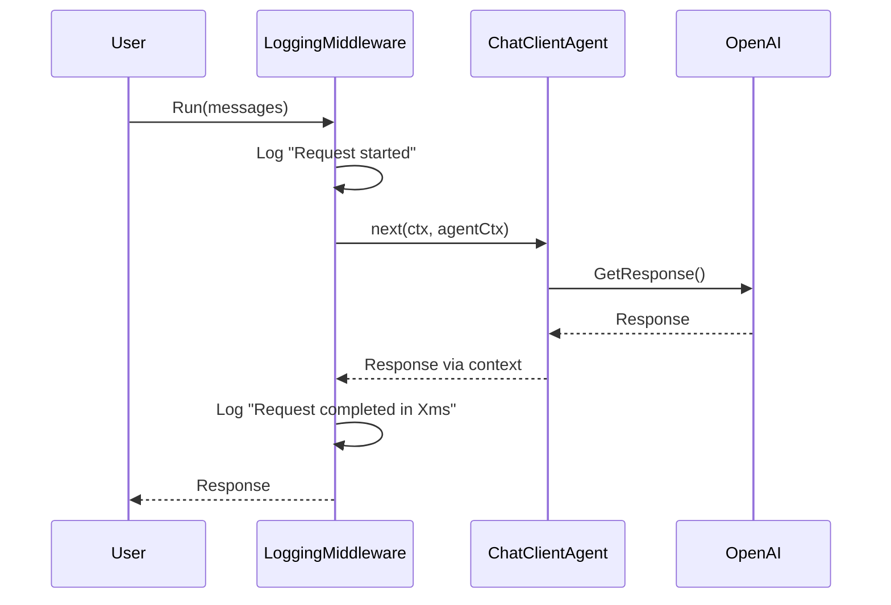
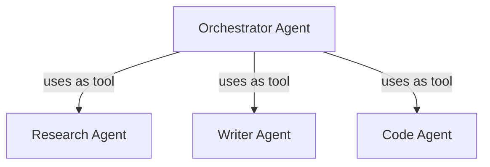

<!-- markdownlint-disable-file -->
# Task Research: Go Middleware Patterns for Agent Framework

This research investigates middleware patterns for the Go agent framework, addressing the critical gaps identified in the Epic 2 comprehensive review. The goal is to design idiomatic Go middleware that aligns with both the .NET and Python implementations while following Go best practices.

## Task Implementation Requests

* Design middleware interface patterns for agent invocations (AgentMiddleware)
* Design middleware interface patterns for function/tool invocations (FunctionMiddleware)
* Design middleware interface patterns for chat client requests (ChatMiddleware)
* Implement a DelegatingAgent pattern for the decorator pattern
* Add builder support for middleware chaining via `Use()` method
* Design agent-to-tool conversion (`AsTool()` method)

## Scope and Success Criteria

* Scope: Middleware system for Go agent framework covering agent, function, and chat middleware types; excludes providers and observability integration
* Assumptions:
  * Go 1.21+ is the target version
  * The existing agent.Agent interface should remain backward compatible
  * Context propagation follows Go's standard context.Context patterns
  * Streaming operations require special consideration
* Success Criteria:
  * Middleware interfaces are idiomatic Go
  * Patterns align with .NET and Python implementations conceptually
  * Builder supports `Use()` for chaining middleware
  * Agent-to-tool conversion enables hierarchical agent patterns
  * Both sync and streaming operations are supported

## Outline

1. Cross-Platform Pattern Analysis
2. Go Idiomatic Middleware Patterns
3. Recommended Implementation Approach
4. Technical Scenarios with Examples
5. Follow-Up Work

### Potential Next Research

* Integration with OpenTelemetry observability through middleware
  * Reasoning: InstrumentedAgent wrapper could be implemented as middleware
  * Reference: [observability package](go/observability/)
* Context provider pattern implementation
  * Reasoning: Dynamic context injection before agent runs
  * Reference: Python's ContextProvider protocol

## Research Executed

### File Analysis

* [dotnet/src/Microsoft.Agents.AI.Abstractions/DelegatingAIAgent.cs](dotnet/src/Microsoft.Agents.AI.Abstractions/DelegatingAIAgent.cs)
  * Lines 1-97: Abstract base class implementing decorator pattern for agents
  * Wraps an inner agent and forwards all operations to it
  * Derived classes override specific methods to add custom behavior
  * Key pattern: `InnerAgent` property exposes wrapped agent

* [dotnet/src/Microsoft.Agents.AI/FunctionInvocationDelegatingAgent.cs](dotnet/src/Microsoft.Agents.AI/FunctionInvocationDelegatingAgent.cs)
  * Lines 1-87: Decorates agent to add function invocation middleware
  * Uses `Func<AIAgent, FunctionInvocationContext, Func<...>, CancellationToken, ValueTask<object?>>` delegate
  * Intercepts tool invocation by wrapping AIFunction with MiddlewareEnabledFunction
  * Key pattern: Modifies run options to inject middleware-enabled functions

* [dotnet/src/Microsoft.Agents.AI/AIAgentBuilder.cs](dotnet/src/Microsoft.Agents.AI/AIAgentBuilder.cs)
  * Lines 1-173: Builder pattern for creating agent pipelines
  * `Use(Func<AIAgent, AIAgent>)`: Adds decorator factory to pipeline
  * `Use(sharedFunc)`: Creates AnonymousDelegatingAIAgent for both Run and RunStream
  * Factories applied in reverse order (first added = outermost)

* [python/packages/core/agent_framework/_middleware.py](python/packages/core/agent_framework/_middleware.py)
  * Lines 1-450+: Comprehensive middleware system with three types
  * `AgentMiddleware`: Intercepts agent.run/run_stream calls
  * `FunctionMiddleware`: Intercepts tool/function invocations
  * `ChatMiddleware`: Intercepts chat client requests
  * Context objects: `AgentRunContext`, `FunctionInvocationContext`, `ChatContext`
  * Pattern: `async def process(self, context: TContext, next: Callable[..., Awaitable[None]]) -> None`

* [python/packages/core/agent_framework/_agents.py](python/packages/core/agent_framework/_agents.py)
  * Lines 411-502: `as_tool()` method implementation
  * Creates FunctionTool wrapping agent with configurable name, description, arg_name
  * Supports streaming via optional callback
  * Sets `_forward_runtime_kwargs = True` for context propagation

* [go/agent/agent.go](go/agent/agent.go)
  * Lines 1-68: Current Agent interface definition
  * Methods: ID, Name, Description, Metadata, Run, RunStream, NewSession, RestoreSession, GetService
  * No middleware or delegation support currently

* [go/chatagent/agent.go](go/chatagent/agent.go)
  * Lines 1-284: ChatClientAgent implementation
  * Run/RunStream methods prepare messages and call `runWithToolLoop`
  * Uses functional options pattern via `Option` type
  * Builder pattern available in builder.go

* [go/chatagent/builder.go](go/chatagent/builder.go)
  * Lines 1-153: Fluent builder API
  * Currently only configures single agent, no `Use()` for decorators
  * Returns `*Agent`, not `agent.Agent` interface

* [go/chatagent/toolloop.go](go/chatagent/toolloop.go)
  * Lines 1-150+: Tool invocation loop implementation
  * `runWithToolLoop`: Non-streaming tool execution
  * `runStreamWithToolLoop`: Streaming tool execution
  * Potential middleware insertion points: before/after tool invocation

### Code Search Results

* `DelegatingAIAgent|DelegatingAgent` in dotnet/**/*.cs
  * 21 matches across src and tests
  * Primary implementations: DelegatingAIAgent.cs, FunctionInvocationDelegatingAgent.cs
  * Tests demonstrate chaining, middleware execution order, exception handling

* `AgentMiddleware|FunctionMiddleware|ChatMiddleware` in python/**/*.py
  * 20+ matches in middleware module and samples
  * Sample implementations in `python/samples/getting_started/middleware/`
  * Shows practical usage patterns for security, logging, caching

* `type Agent interface` in go/**/*.go
  * 2 matches: agent.go (definition) and doc.go (documentation)
  * Current interface has no middleware support

### External Research

* github_repo: `go-chi/chi` - HTTP middleware patterns
  * Middleware signature: `func(next http.Handler) http.Handler`
  * Chain builds by wrapping handlers in reverse order
  * `Use()` method appends to middleware stack
  * `chain()` function composes middlewares with endpoint

* github_repo: `grpc/grpc-go` - Interceptor patterns
  * Unary: `func(ctx, req, info, handler) (resp, error)`
  * Stream: `func(srv, stream, info, handler) error`
  * `ChainUnaryInterceptor`, `ChainStreamInterceptor` for composition
  * Separate interceptors for client and server sides
  * `wrappedStream` pattern for stream interception

### Project Conventions

* Standards referenced:
  * Go functional options pattern (currently used for agent configuration)
  * Builder pattern for fluent configuration
  * Interface segregation (agent.Agent is minimal)
* Instructions followed:
  * `.github/copilot-instructions.md`: Go code under `go/` directory
  * Go-idiomatic patterns preferred over direct ports

## Key Discoveries

### Project Structure

The Go agent framework follows a layered architecture:

```text
go/
├── agent/          # Core abstractions (Agent interface)
├── chat/           # Chat client abstraction
├── chatagent/      # ChatClientAgent implementation
├── tool/           # Tool system (already implemented)
├── providers/      # LLM providers (OpenAI implemented)
└── observability/  # OpenTelemetry instrumentation
```

Middleware should be added to:
* `go/agent/` - Core middleware interfaces and contexts
* `go/chatagent/` - Middleware integration into ChatClientAgent

### Implementation Patterns

#### Cross-Platform Pattern Comparison

| Aspect | .NET | Python | Go (Proposed) |
|--------|------|--------|---------------|
| Middleware base | `DelegatingAIAgent` abstract class | `AgentMiddleware` ABC | `AgentMiddleware` interface |
| Invocation pattern | Decorator wrapping | `async process(ctx, next)` | `func(ctx, req, next) (resp, error)` |
| Context object | Passed via method params | `AgentRunContext` class | `AgentContext` struct |
| Chaining | Builder.Use() with factory | Middleware list in constructor | Builder.Use() with factory |
| Streaming | Unified via async patterns | is_streaming flag on context | Separate Run/RunStream handlers |
| Agent-to-tool | Not implemented | `as_tool()` method | `AsTool()` method |

#### Go Idiomatic Patterns

From chi and gRPC analysis:

1. **Middleware Signature Pattern**
   ```go
   // chi-style (handler wrapping)
   type Middleware func(next Handler) Handler
   
   // gRPC-style (interceptor)
   type UnaryInterceptor func(ctx context.Context, req any, info *Info, handler Handler) (any, error)
   ```

2. **Chain Composition**
   ```go
   func chain(middlewares []Middleware, endpoint Handler) Handler {
       h := endpoint
       for i := len(middlewares) - 1; i >= 0; i-- {
           h = middlewares[i](h)
       }
       return h
   }
   ```

3. **Stream Interception**
   ```go
   // Wrap stream to intercept messages
   type wrappedStream struct {
       grpc.ServerStream
       ctx context.Context
   }
   ```

### Complete Examples

#### AgentMiddleware Interface (Proposed)

```go
// AgentContext holds context for agent middleware invocations.
type AgentContext struct {
    Agent      Agent
    Messages   []Message
    Session    Session
    Options    *RunConfig
    Metadata   map[string]any
    
    // Response fields (set after calling next or to override)
    Response   *Response       // For non-streaming
    Stream     <-chan ResponseUpdate // For streaming
    IsStreaming bool
}

// AgentMiddleware intercepts agent invocations.
type AgentMiddleware interface {
    // Process handles an agent invocation.
    // Call next to continue the chain, or return early to short-circuit.
    Process(ctx context.Context, agentCtx *AgentContext, next AgentHandler) error
}

// AgentHandler is the next handler in the middleware chain.
type AgentHandler func(ctx context.Context, agentCtx *AgentContext) error

// AgentMiddlewareFunc is a function adapter for AgentMiddleware.
type AgentMiddlewareFunc func(ctx context.Context, agentCtx *AgentContext, next AgentHandler) error

func (f AgentMiddlewareFunc) Process(ctx context.Context, agentCtx *AgentContext, next AgentHandler) error {
    return f(ctx, agentCtx, next)
}
```

#### FunctionMiddleware Interface (Proposed)

```go
// FunctionContext holds context for function invocations.
type FunctionContext struct {
    Function  tool.Tool
    Arguments json.RawMessage
    Metadata  map[string]any
    
    // Result fields (set after calling next or to override)
    Result    any
    Error     error
}

// FunctionMiddleware intercepts tool/function invocations.
type FunctionMiddleware interface {
    Process(ctx context.Context, funcCtx *FunctionContext, next FunctionHandler) error
}

type FunctionHandler func(ctx context.Context, funcCtx *FunctionContext) error
```

#### DelegatingAgent Implementation (Proposed)

```go
// DelegatingAgent wraps an inner agent to enable the decorator pattern.
type DelegatingAgent struct {
    inner Agent
}

// NewDelegatingAgent creates a new delegating agent.
func NewDelegatingAgent(inner Agent) *DelegatingAgent {
    return &DelegatingAgent{inner: inner}
}

func (d *DelegatingAgent) ID() string { return d.inner.ID() }
func (d *DelegatingAgent) Name() string { return d.inner.Name() }
func (d *DelegatingAgent) Description() string { return d.inner.Description() }
func (d *DelegatingAgent) Metadata() AIAgentMetadata { return d.inner.Metadata() }

func (d *DelegatingAgent) Run(ctx context.Context, messages []Message, opts ...RunOption) (*Response, error) {
    return d.inner.Run(ctx, messages, opts...)
}

func (d *DelegatingAgent) RunStream(ctx context.Context, messages []Message, opts ...RunOption) (<-chan ResponseUpdate, error) {
    return d.inner.RunStream(ctx, messages, opts...)
}

func (d *DelegatingAgent) NewSession(ctx context.Context) (Session, error) {
    return d.inner.NewSession(ctx)
}

func (d *DelegatingAgent) RestoreSession(ctx context.Context, data json.RawMessage) (Session, error) {
    return d.inner.RestoreSession(ctx, data)
}

func (d *DelegatingAgent) GetService(serviceType reflect.Type) interface{} {
    return d.inner.GetService(serviceType)
}

// Inner returns the wrapped agent.
func (d *DelegatingAgent) Inner() Agent { return d.inner }
```

#### Builder.Use() Extension (Proposed)

```go
// AgentFactory creates a decorated agent from an inner agent.
type AgentFactory func(inner agent.Agent) agent.Agent

// AgentBuilder builds agent pipelines with middleware.
type AgentBuilder struct {
    innerFactory func() agent.Agent
    factories    []AgentFactory
}

// NewAgentBuilder creates a new agent builder.
func NewAgentBuilder(createAgent func() agent.Agent) *AgentBuilder {
    return &AgentBuilder{
        innerFactory: createAgent,
        factories:    make([]AgentFactory, 0),
    }
}

// Use adds a decorator factory to the pipeline.
// Factories are applied in reverse order (first added = outermost).
func (b *AgentBuilder) Use(factory AgentFactory) *AgentBuilder {
    b.factories = append(b.factories, factory)
    return b
}

// Build creates the configured agent with all decorators applied.
func (b *AgentBuilder) Build() agent.Agent {
    inner := b.innerFactory()
    
    // Apply in reverse order so first Use() is outermost
    for i := len(b.factories) - 1; i >= 0; i-- {
        inner = b.factories[i](inner)
    }
    
    return inner
}
```

#### AsTool() Implementation (Proposed)

```go
// AsToolOptions configures agent-to-tool conversion.
type AsToolOptions struct {
    Name           string
    Description    string
    ArgName        string
    ArgDescription string
    StreamCallback func(ResponseUpdate)
}

// AsTool converts an agent to a tool for use by other agents.
func AsTool(a agent.Agent, opts AsToolOptions) tool.Tool {
    name := opts.Name
    if name == "" {
        name = sanitizeAgentName(a.Name())
    }
    
    desc := opts.Description
    if desc == "" {
        desc = a.Description()
    }
    
    argName := opts.ArgName
    if argName == "" {
        argName = "task"
    }
    
    argDesc := opts.ArgDescription
    if argDesc == "" {
        argDesc = fmt.Sprintf("Task for %s", name)
    }
    
    // Create parameters schema
    params := map[string]any{
        "type": "object",
        "properties": map[string]any{
            argName: map[string]any{
                "type":        "string",
                "description": argDesc,
            },
        },
        "required": []string{argName},
    }
    paramsJSON, _ := json.Marshal(params)
    
    return tool.NewFunction(name, desc, paramsJSON, func(ctx context.Context, args json.RawMessage) (string, error) {
        // Parse args to get the task input
        var parsed map[string]string
        if err := json.Unmarshal(args, &parsed); err != nil {
            return "", err
        }
        
        input := parsed[argName]
        messages := []agent.Message{agent.NewUserMessage(input)}
        
        if opts.StreamCallback != nil {
            // Streaming mode
            updates, err := a.RunStream(ctx, messages)
            if err != nil {
                return "", err
            }
            
            var lastUpdate agent.ResponseUpdate
            for update := range updates {
                opts.StreamCallback(update)
                lastUpdate = update
            }
            
            // Return final text
            return lastUpdate.Text, nil
        }
        
        // Non-streaming mode
        resp, err := a.Run(ctx, messages)
        if err != nil {
            return "", err
        }
        
        return resp.Text(), nil
    })
}
```

### API and Schema Documentation

The middleware system requires these new types in the `agent` package:

| Type | Purpose |
|------|---------|
| `AgentMiddleware` | Interface for agent-level middleware |
| `AgentContext` | Context struct for agent middleware |
| `AgentHandler` | Next handler type for agent middleware |
| `FunctionMiddleware` | Interface for function-level middleware |
| `FunctionContext` | Context struct for function middleware |
| `FunctionHandler` | Next handler type for function middleware |
| `DelegatingAgent` | Base type for agent decorators |
| `AgentBuilder` | Pipeline builder with `Use()` support |
| `AsToolOptions` | Configuration for agent-to-tool conversion |

### Configuration Examples

#### Using Middleware with ChatClientAgent

```go
// Create agent with middleware
agent := chatagent.NewBuilder(client).
    Name("WeatherAgent").
    Instructions("You are a helpful weather assistant.").
    Tools(getWeather).
    Middleware(
        LoggingMiddleware{},
        SecurityMiddleware{blockedPatterns: []string{"password", "secret"}},
    ).
    Build()

// Or using the builder pattern
agent := agentbuilder.New(func() agent.Agent {
    return chatagent.New(client,
        chatagent.WithName("WeatherAgent"),
        chatagent.WithInstructions("You are a helpful assistant."),
    )
}).
    Use(WithLogging(logger)).
    Use(WithRateLimiting(10, time.Second)).
    Build()
```

#### Using Agent as Tool

```go
// Create specialized agent
researcher := chatagent.New(researchClient,
    chatagent.WithName("Researcher"),
    chatagent.WithDescription("Performs in-depth research on topics"),
)

// Convert to tool for orchestrator
researchTool := chatagent.AsTool(researcher, chatagent.AsToolOptions{
    Name:        "research",
    Description: "Research a topic and provide detailed information",
    ArgName:     "topic",
})

// Use in orchestrator
orchestrator := chatagent.New(client,
    chatagent.WithName("Orchestrator"),
    chatagent.WithTools(researchTool, otherTools...),
)
```

## Technical Scenarios

### Scenario 1: Agent Middleware for Logging

**Requirements:**
* Log all agent invocations with timing
* Capture input/output for debugging
* Non-intrusive integration

**Preferred Approach:**
* Implement `AgentMiddleware` interface
* Log before calling next, measure duration, log after

```text
go/
└── chatagent/
    ├── middleware.go       # Middleware types and chain
    └── middleware/
        └── logging.go      # Logging middleware implementation
```



**Implementation Details:**

```go
type LoggingMiddleware struct {
    Logger *slog.Logger
}

func (m *LoggingMiddleware) Process(ctx context.Context, agentCtx *agent.AgentContext, next agent.AgentHandler) error {
    start := time.Now()
    m.Logger.Info("Agent invocation started",
        "agent", agentCtx.Agent.Name(),
        "message_count", len(agentCtx.Messages),
    )
    
    err := next(ctx, agentCtx)
    
    duration := time.Since(start)
    if err != nil {
        m.Logger.Error("Agent invocation failed",
            "agent", agentCtx.Agent.Name(),
            "duration", duration,
            "error", err,
        )
    } else {
        m.Logger.Info("Agent invocation completed",
            "agent", agentCtx.Agent.Name(),
            "duration", duration,
        )
    }
    
    return err
}
```

#### Considered Alternatives

* Decorator pattern only: Less flexible, harder to compose multiple behaviors
* Observer pattern: Can't intercept or modify requests

### Scenario 2: Function Middleware for Validation

**Requirements:**
* Validate tool arguments before execution
* Provide custom error messages
* Allow blocking certain functions

**Preferred Approach:**
* Implement `FunctionMiddleware` interface
* Check arguments, optionally short-circuit

```text
go/
└── chatagent/
    └── middleware/
        └── validation.go   # Validation middleware
```

**Implementation Details:**

```go
type ValidationMiddleware struct {
    Validators map[string]func(json.RawMessage) error
}

func (m *ValidationMiddleware) Process(ctx context.Context, funcCtx *agent.FunctionContext, next agent.FunctionHandler) error {
    if validator, ok := m.Validators[funcCtx.Function.Name()]; ok {
        if err := validator(funcCtx.Arguments); err != nil {
            funcCtx.Error = fmt.Errorf("validation failed: %w", err)
            return nil // Short-circuit, don't call next
        }
    }
    return next(ctx, funcCtx)
}
```

### Scenario 3: Hierarchical Agents with AsTool

**Requirements:**
* Orchestrator agent delegates to specialized agents
* Specialized agents appear as tools
* Support for streaming responses

**Preferred Approach:**
* Use `AsTool()` to convert agents to tools
* Configure with appropriate names and descriptions



**Implementation Details:**

```go
// Specialized agents
researcher := chatagent.New(client, chatagent.WithName("Researcher"))
writer := chatagent.New(client, chatagent.WithName("Writer"))
coder := chatagent.New(client, chatagent.WithName("Coder"))

// Convert to tools
tools := []tool.Tool{
    chatagent.AsTool(researcher, chatagent.AsToolOptions{
        Name:        "research",
        Description: "Research a topic",
    }),
    chatagent.AsTool(writer, chatagent.AsToolOptions{
        Name:        "write",
        Description: "Write content",
    }),
    chatagent.AsTool(coder, chatagent.AsToolOptions{
        Name:        "code",
        Description: "Write code",
    }),
}

// Orchestrator uses specialized agents as tools
orchestrator := chatagent.New(client,
    chatagent.WithName("Orchestrator"),
    chatagent.WithTools(tools...),
)
```

## Follow-Up Work

### Immediate Implementation (Epic 2 Completion)

1. **Create middleware package structure**
   * Files: `go/agent/middleware.go`, `go/agent/context.go`
   * Contains: AgentMiddleware, FunctionMiddleware interfaces and context types

2. **Implement DelegatingAgent**
   * File: `go/agent/delegating.go`
   * Contains: Base delegating agent for decorator pattern

3. **Implement AgentBuilder with Use()**
   * File: `go/agent/builder.go`
   * Contains: Pipeline builder supporting middleware chaining

4. **Implement AsTool()**
   * File: `go/chatagent/astool.go`
   * Contains: Agent-to-tool conversion function

5. **Integrate middleware into ChatClientAgent**
   * Modify: `go/chatagent/agent.go`, `go/chatagent/toolloop.go`
   * Add middleware execution points in Run/RunStream

### Future Enhancements

6. **Built-in middleware implementations**
   * Logging middleware
   * Rate limiting middleware
   * Retry middleware with exponential backoff
   * Caching middleware

7. **ChatMiddleware for chat client interception**
   * Lower-level interception than AgentMiddleware
   * Useful for request/response transformation

8. **Context provider integration**
   * Dynamic context injection pattern
   * Aligns with Python's ContextProvider protocol

## Summary

This research provides a comprehensive design for implementing middleware patterns in the Go agent framework. The key design decisions are:

1. **Interface-based middleware**: Following Go idioms with interface + context struct pattern
2. **Dual-path support**: Handle both streaming and non-streaming via context flags
3. **Builder pattern extension**: Add `Use()` method for pipeline composition
4. **Agent-to-tool conversion**: Enable hierarchical agent patterns
5. **gRPC-inspired chaining**: Apply middlewares in reverse order for intuitive execution

The implementation aligns conceptually with .NET's DelegatingAIAgent and Python's middleware classes while remaining idiomatic Go. This addresses the critical gaps identified in the Epic 2 review.
